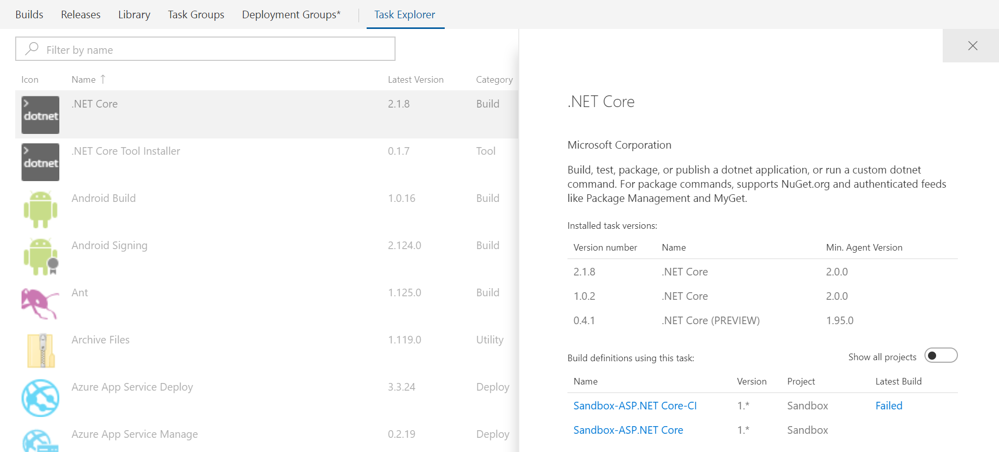

# Build Task Explorer #
Have you ever wonder where that particular build task was used? This extension adds an additional tab in Build and Release hub that lets you:

- See installed tasks
- Search for a specific task
- View details of a selected task:
    - Installed versions
    - Build definitions that use it
    - Status of the latest builds that use it

Since a task can be used in any team project an option is available on the details page to show which definitions the selected task is used regardless of project.



# Building the extension #


The extension is built and deployed to the VSTS Marketpace using VSTS, if you want to contibute to the public extension see [Contributions are welcome](#contributions-are-welcome).

## Building the extension ##

After cloning the repo change publisher and package settings in manifests/base.json. 

Dev workflow:
1. install tfx-cli globally: ```npm install -g tfx-cli```
1. run from root: ```tfx extension create --root ./ --output-path ./publish/ --manifests ./manifests/base.json --overrides-file manifests/dev.json --rev-version```
1. deploy the vsix file from publish/ folder to marketplace manually and share it with VSTS account where you want to test
1. install extension in account
1. run ```npm start``` from root of the project. This will start webpack-dev-server and serve your application to https://localhost:8080 where VSTS will pick it up. It might be necessary to visit the location directly first to persuade Chrome to ignore untrusted certificate.

# Contributions #

## Team ##

We thank the following contributor(s): **Damir Petrač** and **Mathias Olausson**.

## Contributions are welcome ##

Here is how you can contribute to this project:  

- Submit bugs and help us verify fixes  
- Submit pull requests for bug fixes and features and discuss existing proposals   

Please refer to [Contribution guidelines](discovery/CONTRIBUTING.md) and the [Code of Conduct](discovery/CODE_OF_CONDUCT.md) for more details.
